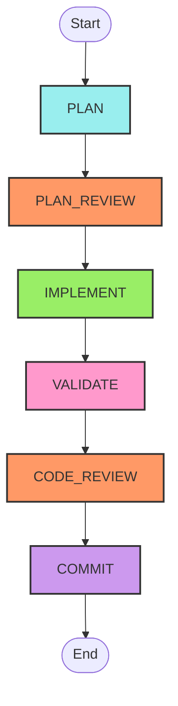
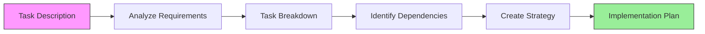
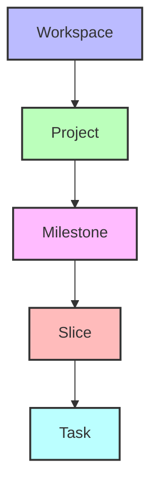

# Convoy Workflow (Uppercase Components)

This document provides an overview of the Convoy AI agent workflow, with interactive diagrams.

## Workflow Overview

The Convoy workflow follows these key stages:



## Workflow Stages

### 1. PLAN Stage

The AI agent analyzes the task and creates an implementation strategy.



### 2. PLAN_REVIEW Checkpoint

The implementation plan is reviewed by a human.

### 3. IMPLEMENT Stage

The AI agent executes the approved plan step by step.

### 4. VALIDATE Stage

The implementation is verified against requirements.

### 5. CODE_REVIEW Checkpoint

The changes are reviewed by a human.

### 6. COMMIT Stage

The approved changes are finalized and committed.

## Hierarchical Context



## Knowledge Graph Integration

```mermaid
flowchart LR
    KG[Knowledge Graph] <-->|Informs| Plan
    KG <-->|Provides Context| Implement
    KG <-->|Updates With| Results[Task Results]

    style KG fill:#fcf, stroke:#333, stroke-width:2px
    style Results fill:#cff, stroke:#333, stroke-width:2px
