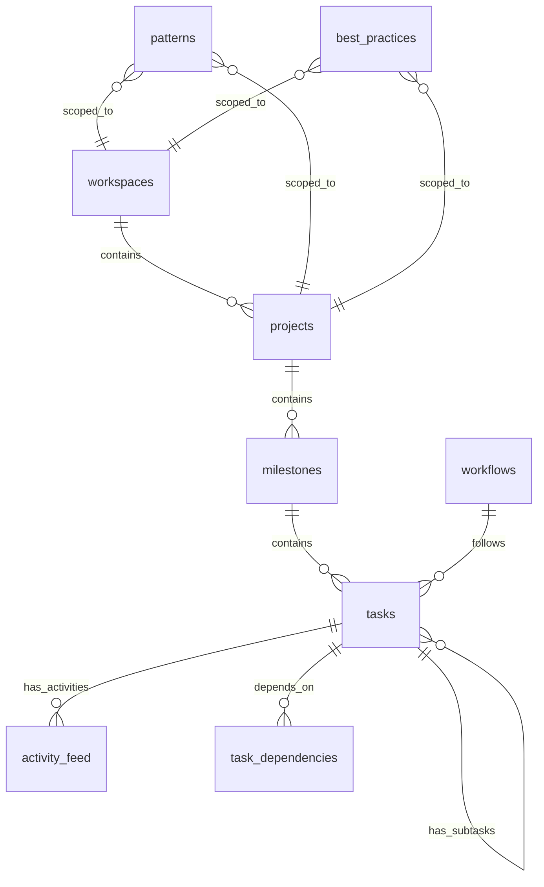

# Supabase Database Schema

The Convoy database schema is implemented in Supabase using a declarative approach, allowing for version control and consistent deployment across environments. This document provides a detailed reference for the database schema.

## Schema Overview

The schema consists of several core tables that form the backbone of the Convoy knowledge graph:



## Core Tables

### workspaces

The `workspaces` table represents the top-level organizational container for Convoy projects.

```sql
CREATE TABLE workspaces (
  id UUID PRIMARY KEY DEFAULT uuid_generate_v4(),
  name TEXT NOT NULL,
  description TEXT,
  created_at TIMESTAMP WITH TIME ZONE DEFAULT NOW(),
  updated_at TIMESTAMP WITH TIME ZONE DEFAULT NOW()
);
```

| Column | Type | Description |
|--------|------|-------------|
| id | UUID | Unique identifier for the workspace |
| name | TEXT | Name of the workspace |
| description | TEXT | Optional description of the workspace |
| created_at | TIMESTAMP | When the workspace was created |
| updated_at | TIMESTAMP | When the workspace was last updated |

### projects

The `projects` table represents projects within a workspace.

```sql
CREATE TABLE projects (
  id UUID PRIMARY KEY DEFAULT uuid_generate_v4(),
  workspace_id UUID NOT NULL REFERENCES workspaces(id) ON DELETE CASCADE,
  name TEXT NOT NULL,
  description TEXT,
  overview TEXT,
  tech_stack JSONB,
  status TEXT DEFAULT 'ACTIVE',
  created_at TIMESTAMP WITH TIME ZONE DEFAULT NOW(),
  updated_at TIMESTAMP WITH TIME ZONE DEFAULT NOW()
);
```

| Column | Type | Description |
|--------|------|-------------|
| id | UUID | Unique identifier for the project |
| workspace_id | UUID | Reference to the workspace this project belongs to |
| name | TEXT | Name of the project |
| description | TEXT | Optional description of the project |
| overview | TEXT | Detailed overview of the project |
| tech_stack | JSONB | JSON object describing the technology stack |
| status | TEXT | Project status (e.g., 'ACTIVE', 'COMPLETED', etc.) |
| created_at | TIMESTAMP | When the project was created |
| updated_at | TIMESTAMP | When the project was last updated |

### milestones

The `milestones` table represents milestone deliverables within a project.

```sql
CREATE TABLE milestones (
  id UUID PRIMARY KEY DEFAULT uuid_generate_v4(),
  project_id UUID NOT NULL REFERENCES projects(id) ON DELETE CASCADE,
  name TEXT NOT NULL,
  description TEXT,
  requirements TEXT,
  status TEXT DEFAULT 'PLANNED',
  target_date TIMESTAMP WITH TIME ZONE,
  created_at TIMESTAMP WITH TIME ZONE DEFAULT NOW(),
  updated_at TIMESTAMP WITH TIME ZONE DEFAULT NOW()
);
```

| Column | Type | Description |
|--------|------|-------------|
| id | UUID | Unique identifier for the milestone |
| project_id | UUID | Reference to the project this milestone belongs to |
| name | TEXT | Name of the milestone |
| description | TEXT | Optional description of the milestone |
| requirements | TEXT | Detailed requirements for the milestone |
| status | TEXT | Milestone status (e.g., 'PLANNED', 'IN_PROGRESS', 'COMPLETED') |
| target_date | TIMESTAMP | Target completion date for the milestone |
| created_at | TIMESTAMP | When the milestone was created |
| updated_at | TIMESTAMP | When the milestone was last updated |

### tasks

The `tasks` table represents individual work items within a milestone.

```sql
CREATE TABLE tasks (
  id UUID PRIMARY KEY DEFAULT uuid_generate_v4(),
  milestone_id UUID NOT NULL REFERENCES milestones(id) ON DELETE CASCADE,
  parent_task_id UUID REFERENCES tasks(id) ON DELETE SET NULL,
  title TEXT NOT NULL,
  description TEXT,
  current_stage TEXT DEFAULT 'PLAN',
  status TEXT DEFAULT 'TODO',
  created_at TIMESTAMP WITH TIME ZONE DEFAULT NOW(),
  updated_at TIMESTAMP WITH TIME ZONE DEFAULT NOW(),
  completion_date TIMESTAMP WITH TIME ZONE
);
```

| Column | Type | Description |
|--------|------|-------------|
| id | UUID | Unique identifier for the task |
| milestone_id | UUID | Reference to the milestone this task belongs to |
| parent_task_id | UUID | Reference to parent task if this is a subtask |
| title | TEXT | Title of the task |
| description | TEXT | Detailed description of the task |
| current_stage | TEXT | Current workflow stage (e.g., 'PLAN', 'IMPLEMENT', etc.) |
| status | TEXT | Task status (e.g., 'TODO', 'IN_PROGRESS', 'DONE') |
| created_at | TIMESTAMP | When the task was created |
| updated_at | TIMESTAMP | When the task was last updated |
| completion_date | TIMESTAMP | When the task was completed |

### task_dependencies

The `task_dependencies` table tracks dependencies between tasks.

```sql
CREATE TABLE task_dependencies (
  id UUID PRIMARY KEY DEFAULT uuid_generate_v4(),
  task_id UUID NOT NULL REFERENCES tasks(id) ON DELETE CASCADE,
  depends_on_task_id UUID NOT NULL REFERENCES tasks(id) ON DELETE CASCADE,
  created_at TIMESTAMP WITH TIME ZONE DEFAULT NOW(),
  UNIQUE(task_id, depends_on_task_id),
  CHECK(task_id != depends_on_task_id)
);
```

| Column | Type | Description |
|--------|------|-------------|
| id | UUID | Unique identifier for the dependency |
| task_id | UUID | Reference to the task that depends on another |
| depends_on_task_id | UUID | Reference to the task that is depended upon |
| created_at | TIMESTAMP | When the dependency was created |

### activity_feed

The `activity_feed` table tracks activities related to tasks.

```sql
CREATE TABLE activity_feed (
  id UUID PRIMARY KEY DEFAULT uuid_generate_v4(),
  task_id UUID NOT NULL REFERENCES tasks(id) ON DELETE CASCADE,
  actor_id UUID,
  activity_type TEXT NOT NULL,
  details JSONB,
  created_at TIMESTAMP WITH TIME ZONE DEFAULT NOW()
);
```

| Column | Type | Description |
|--------|------|-------------|
| id | UUID | Unique identifier for the activity |
| task_id | UUID | Reference to the task this activity relates to |
| actor_id | UUID | Optional reference to the user who performed the activity |
| activity_type | TEXT | Type of activity (e.g., 'STAGE_CHANGE', 'TASK_UPDATED') |
| details | JSONB | JSON object with activity details |
| created_at | TIMESTAMP | When the activity occurred |

### workflows

The `workflows` table defines workflow process definitions.

```sql
CREATE TABLE workflows (
  id UUID PRIMARY KEY DEFAULT uuid_generate_v4(),
  name TEXT NOT NULL,
  description TEXT,
  stages JSONB NOT NULL,
  created_at TIMESTAMP WITH TIME ZONE DEFAULT NOW(),
  updated_at TIMESTAMP WITH TIME ZONE DEFAULT NOW()
);
```

| Column | Type | Description |
|--------|------|-------------|
| id | UUID | Unique identifier for the workflow |
| name | TEXT | Name of the workflow |
| description | TEXT | Optional description of the workflow |
| stages | JSONB | JSON object defining workflow stages |
| created_at | TIMESTAMP | When the workflow was created |
| updated_at | TIMESTAMP | When the workflow was last updated |

### patterns

The `patterns` table stores reusable implementation patterns.

```sql
CREATE TABLE patterns (
  id UUID PRIMARY KEY DEFAULT uuid_generate_v4(),
  workspace_id UUID REFERENCES workspaces(id) ON DELETE CASCADE,
  project_id UUID REFERENCES projects(id) ON DELETE CASCADE,
  name TEXT NOT NULL,
  description TEXT,
  pattern_type TEXT NOT NULL,
  content JSONB NOT NULL,
  created_at TIMESTAMP WITH TIME ZONE DEFAULT NOW(),
  updated_at TIMESTAMP WITH TIME ZONE DEFAULT NOW(),
  CHECK (
    (workspace_id IS NULL AND project_id IS NULL) OR
    (workspace_id IS NOT NULL AND project_id IS NULL) OR
    (workspace_id IS NULL AND project_id IS NOT NULL)
  )
);
```

| Column | Type | Description |
|--------|------|-------------|
| id | UUID | Unique identifier for the pattern |
| workspace_id | UUID | Optional reference to the workspace this pattern is scoped to |
| project_id | UUID | Optional reference to the project this pattern is scoped to |
| name | TEXT | Name of the pattern |
| description | TEXT | Optional description of the pattern |
| pattern_type | TEXT | Type of pattern (e.g., 'CODE', 'UI', 'ARCHITECTURE') |
| content | JSONB | JSON object with pattern content |
| created_at | TIMESTAMP | When the pattern was created |
| updated_at | TIMESTAMP | When the pattern was last updated |

### best_practices

The `best_practices` table stores best practices for development.

```sql
CREATE TABLE best_practices (
  id UUID PRIMARY KEY DEFAULT uuid_generate_v4(),
  workspace_id UUID REFERENCES workspaces(id) ON DELETE CASCADE,
  project_id UUID REFERENCES projects(id) ON DELETE CASCADE,
  name TEXT NOT NULL,
  description TEXT,
  category TEXT NOT NULL,
  content JSONB NOT NULL,
  created_at TIMESTAMP WITH TIME ZONE DEFAULT NOW(),
  updated_at TIMESTAMP WITH TIME ZONE DEFAULT NOW(),
  CHECK (
    (workspace_id IS NULL AND project_id IS NULL) OR
    (workspace_id IS NOT NULL AND project_id IS NULL) OR
    (workspace_id IS NULL AND project_id IS NOT NULL)
  )
);
```

| Column | Type | Description |
|--------|------|-------------|
| id | UUID | Unique identifier for the best practice |
| workspace_id | UUID | Optional reference to the workspace this best practice is scoped to |
| project_id | UUID | Optional reference to the project this best practice is scoped to |
| name | TEXT | Name of the best practice |
| description | TEXT | Optional description of the best practice |
| category | TEXT | Category of best practice (e.g., 'CODE', 'TESTING', 'DOCUMENTATION') |
| content | JSONB | JSON object with best practice content |
| created_at | TIMESTAMP | When the best practice was created |
| updated_at | TIMESTAMP | When the best practice was last updated |

## Indexes

The schema includes several indexes to optimize query performance:

### Foreign Key Indexes

```sql
CREATE INDEX projects_workspace_id_idx ON projects (workspace_id);
CREATE INDEX milestones_project_id_idx ON milestones (project_id);
CREATE INDEX tasks_milestone_id_idx ON tasks (milestone_id);
CREATE INDEX tasks_parent_task_id_idx ON tasks (parent_task_id);
CREATE INDEX task_dependencies_task_id_idx ON task_dependencies (task_id);
CREATE INDEX task_dependencies_depends_on_task_id_idx ON task_dependencies (depends_on_task_id);
CREATE INDEX activity_feed_task_id_idx ON activity_feed (task_id);
CREATE INDEX activity_feed_created_at_idx ON activity_feed (created_at);
CREATE INDEX patterns_workspace_id_idx ON patterns (workspace_id);
CREATE INDEX patterns_project_id_idx ON patterns (project_id);
CREATE INDEX best_practices_workspace_id_idx ON best_practices (workspace_id);
CREATE INDEX best_practices_project_id_idx ON best_practices (project_id);
```

### Search Field Indexes

```sql
CREATE INDEX workspaces_name_idx ON workspaces (name);
CREATE INDEX projects_name_idx ON projects (name);
CREATE INDEX milestones_name_idx ON milestones (name);
CREATE INDEX tasks_title_idx ON tasks (title);
CREATE INDEX tasks_status_idx ON tasks (status);
CREATE INDEX tasks_current_stage_idx ON tasks (current_stage);
```

### JSONB Indexes

```sql
CREATE INDEX workflows_stages_idx ON workflows USING GIN (stages);
CREATE INDEX patterns_content_idx ON patterns USING GIN (content);
CREATE INDEX best_practices_content_idx ON best_practices USING GIN (content);
```

## Schema Evolution

The schema is designed to be extended and evolved over time. The declarative approach allows for versioned migrations that can be applied incrementally.

The initial migration sets up the core tables and relationships, while future migrations can add new tables, columns, or constraints as needed.

## Best Practices

When working with the Convoy database schema, follow these best practices:

1. **Always use UUIDs for primary keys**: This ensures universally unique identifiers across environments.

2. **Use proper relationships**: Always maintain proper foreign key relationships between tables.

3. **Implement cascading deletes where appropriate**: For example, deleting a workspace should delete all of its associated projects.

4. **Use timestamps for created_at and updated_at**: This provides an audit trail of when entities were created and modified.

5. **Use appropriate indexes**: Ensure that commonly queried fields have indexes to optimize performance.

6. **Use JSONB for flexible structures**: For structures like workflow stages that may vary, use JSONB to provide flexibility.

7. **Validate JSONB content**: While JSONB provides flexibility, ensure that the content follows a defined structure.

## Conclusion

The Convoy database schema provides a solid foundation for the knowledge graph that powers the Memory Bank pattern. By following the conventions and best practices outlined in this document, you can ensure that your database implementation is robust, performant, and maintainable.
