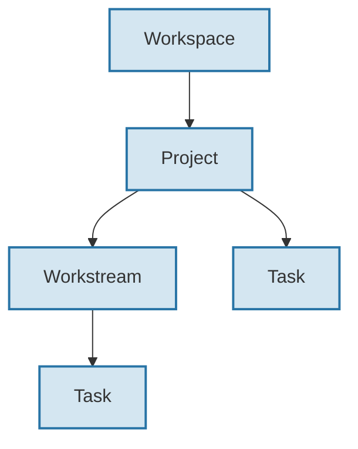
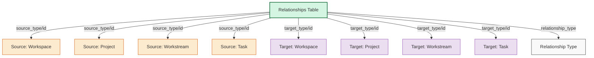
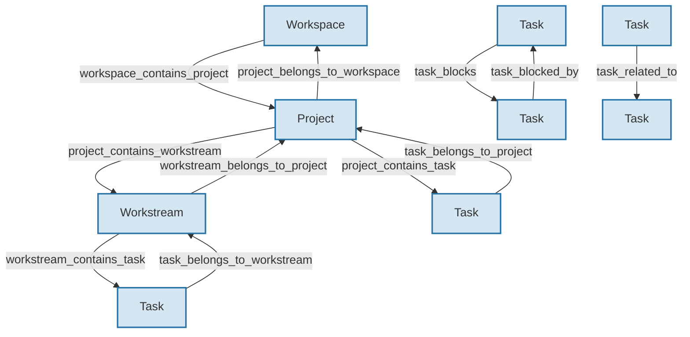
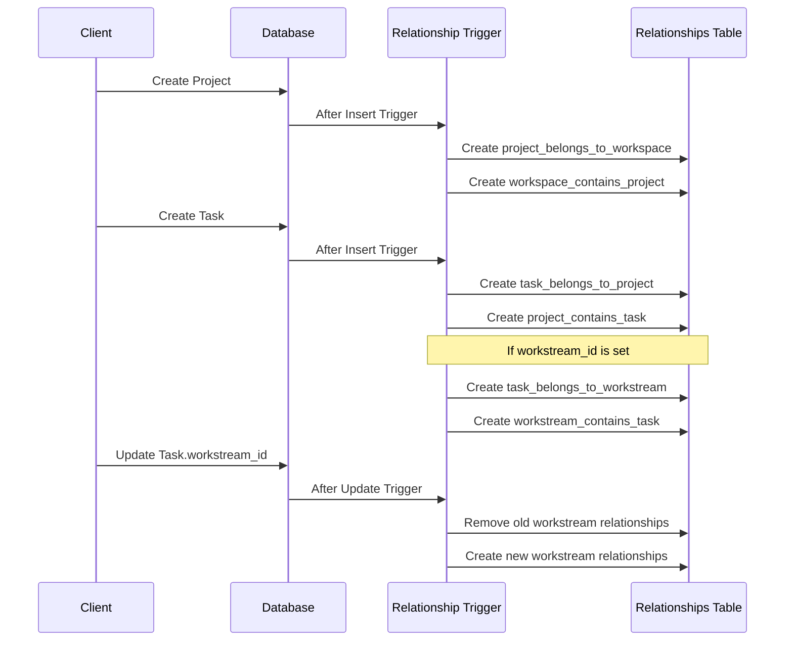
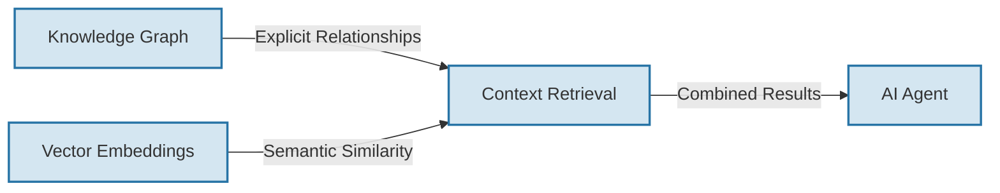

# Database Schema and Relationships

## Overview

This document provides a comprehensive overview of the database schema implemented for the Convoy data architecture. The architecture follows a knowledge graph approach for efficient context retrieval, organizing data in a hierarchical structure while allowing for flexible relationships between entities.

## Entity Hierarchy

The data architecture follows this hierarchical structure:



## Core Entities

### Workspaces

Workspaces are the top-level organizational containers.

| Column | Type | Description |
|--------|------|-------------|
| id | UUID | Primary key |
| name | TEXT | Workspace name |
| description | TEXT | Optional description |
| created_at | TIMESTAMP | Creation timestamp |
| updated_at | TIMESTAMP | Last update timestamp |

### Projects

Projects belong to workspaces and contain workstreams and tasks.

| Column | Type | Description |
|--------|------|-------------|
| id | UUID | Primary key |
| workspace_id | UUID | Reference to parent workspace |
| name | TEXT | Project name |
| description | TEXT | Optional description |
| owner_id | UUID | Reference to owner user |
| status | project_status | Project status (enum) |
| target_date | TIMESTAMP | Target completion date |
| created_at | TIMESTAMP | Creation timestamp |
| updated_at | TIMESTAMP | Last update timestamp |

### Workstreams

Workstreams belong to projects and contain tasks.

| Column | Type | Description |
|--------|------|-------------|
| id | UUID | Primary key |
| project_id | UUID | Reference to parent project |
| name | TEXT | Workstream name |
| description | TEXT | Optional description |
| owner_id | UUID | Reference to owner user |
| status | workstream_status | Workstream status (enum) |
| progress | FLOAT | Completion progress (0-1) |
| created_at | TIMESTAMP | Creation timestamp |
| updated_at | TIMESTAMP | Last update timestamp |

### Tasks

Tasks belong to projects and optionally to workstreams.

| Column | Type | Description |
|--------|------|-------------|
| id | UUID | Primary key |
| project_id | UUID | Reference to parent project |
| workstream_id | UUID | Optional reference to parent workstream |
| title | TEXT | Task title |
| description | TEXT | Optional description |
| owner_id | UUID | Reference to owner user |
| status | task_status | Task status (enum) |
| priority | task_priority | Task priority (enum) |
| labels | JSONB | JSON array of labels |
| relationships | JSONB | Quick reference to relationships |
| created_at | TIMESTAMP | Creation timestamp |
| updated_at | TIMESTAMP | Last update timestamp |

## Knowledge Graph Relationships

The relationships between entities are formalized in a dedicated relationship table, which forms the core of the knowledge graph approach.



### Relationship Table

| Column | Type | Description |
|--------|------|-------------|
| id | UUID | Primary key |
| source_type | entity_type | Type of source entity (enum) |
| source_id | UUID | ID of source entity |
| relationship_type | relationship_type | Type of relationship (enum) |
| target_type | entity_type | Type of target entity (enum) |
| target_id | UUID | ID of target entity |
| metadata | JSONB | Additional relationship data |
| created_at | TIMESTAMP | Creation timestamp |

### Entity Types

The `entity_type` enum defines the types of entities that can participate in relationships:

- `workspace`
- `project`
- `workstream`
- `task`

### Relationship Types

The `relationship_type` enum defines the types of relationships between entities:



The following relationship types are supported:

- **Hierarchical Relationships**:
  - `workspace_contains_project`
  - `project_belongs_to_workspace`
  - `project_contains_workstream`
  - `project_contains_task`
  - `workstream_belongs_to_project`
  - `workstream_contains_task`
  - `task_belongs_to_project`
  - `task_belongs_to_workstream`

- **Task Dependencies**:
  - `task_blocks`
  - `task_blocked_by`
  - `task_related_to`

## Automatic Relationship Management

Relationships are automatically maintained through database triggers:

1. **create_entity_relationships()**: Creates relationships when entities are created
2. **update_entity_relationships()**: Updates relationships when entity references change



## Query Patterns

### Context Retrieval

To retrieve the complete context for an entity, you can traverse the knowledge graph in both directions:

```sql
-- Get context for a task (upward traversal)
WITH RECURSIVE task_context AS (
  -- Start with the task
  SELECT 'task' as entity_type, id as entity_id, title as name, 0 as depth
  FROM tasks
  WHERE id = '[TASK_ID]'
  
  UNION ALL
  
  -- Add related entities (upward traversal)
  SELECT r.target_type, r.target_id, 
    CASE 
      WHEN r.target_type = 'project' THEN (SELECT name FROM projects WHERE id = r.target_id)
      WHEN r.target_type = 'workstream' THEN (SELECT name FROM workstreams WHERE id = r.target_id)
      WHEN r.target_type = 'workspace' THEN (SELECT name FROM workspaces WHERE id = r.target_id)
    END as name,
    tc.depth + 1
  FROM relationships r
  JOIN task_context tc ON r.source_type = tc.entity_type AND r.source_id = tc.entity_id
  WHERE r.relationship_type IN ('task_belongs_to_project', 'task_belongs_to_workstream', 'project_belongs_to_workspace')
)
SELECT * FROM task_context;
```

### Related Tasks

To find all tasks related to a specific task:

```sql
-- Find all related tasks
SELECT t.* 
FROM tasks t
JOIN relationships r ON t.id = r.target_id
WHERE r.source_id = '[TASK_ID]'
AND r.source_type = 'task'
AND r.target_type = 'task';
```

### Workspace Contents

To find all tasks in a workspace by traversing the relationship graph:

```sql
WITH RECURSIVE workspace_entities AS (
  -- Start with the workspace
  SELECT 'workspace' as entity_type, id as entity_id, 0 as depth
  FROM workspaces
  WHERE id = '[WORKSPACE_ID]'
  
  UNION ALL
  
  -- Add related entities
  SELECT r.target_type, r.target_id, we.depth + 1
  FROM relationships r
  JOIN workspace_entities we ON r.source_type = we.entity_type AND r.source_id = we.entity_id
  WHERE r.relationship_type IN ('workspace_contains_project', 'project_contains_workstream', 'project_contains_task', 'workstream_contains_task')
)
SELECT t.*
FROM workspace_entities we
JOIN tasks t ON we.entity_type = 'task' AND we.entity_id = t.id;
```

## AI Context Interfaces

The knowledge graph approach enables efficient context retrieval for AI agents. Here are the patterns for AI context interfaces:

```typescript
// Get context for a task
async function getTaskContext(taskId: string): Promise<TaskContext> {
  // Query to get task details
  const task = await db.tasks.findUnique({ where: { id: taskId } });
  
  // Query to get parent project
  const projectRel = await db.relationships.findFirst({
    where: {
      source_type: 'task',
      source_id: taskId,
      relationship_type: 'task_belongs_to_project'
    }
  });
  const project = projectRel 
    ? await db.projects.findUnique({ where: { id: projectRel.target_id } }) 
    : null;
  
  // Query to get parent workstream if available
  const workstreamRel = await db.relationships.findFirst({
    where: {
      source_type: 'task',
      source_id: taskId,
      relationship_type: 'task_belongs_to_workstream'
    }
  });
  const workstream = workstreamRel 
    ? await db.workstreams.findUnique({ where: { id: workstreamRel.target_id } }) 
    : null;
  
  // Query to get workspace
  const workspaceRel = project ? await db.relationships.findFirst({
    where: {
      source_type: 'project',
      source_id: project.id,
      relationship_type: 'project_belongs_to_workspace'
    }
  }) : null;
  const workspace = workspaceRel
    ? await db.workspaces.findUnique({ where: { id: workspaceRel.target_id } })
    : null;
  
  // Query to get related tasks
  const relatedTaskRels = await db.relationships.findMany({
    where: {
      OR: [
        {
          source_type: 'task',
          source_id: taskId,
          target_type: 'task'
        },
        {
          target_type: 'task',
          target_id: taskId,
          source_type: 'task'
        }
      ]
    }
  });
  
  // Assemble context
  return {
    task,
    project,
    workstream,
    workspace,
    relatedTasks: await fetchRelatedTasks(relatedTaskRels, taskId),
    // Additional context elements...
  };
}
```

## Future Enhancements

### Vector Embeddings

The knowledge graph approach can be enhanced with vector embeddings for semantic search:



### Weighted Relationships

Future enhancements may include weighted relationships to prioritize context:

```typescript
// Relationship with weight
interface WeightedRelationship {
  source_type: EntityType;
  source_id: string;
  relationship_type: RelationshipType;
  target_type: EntityType;
  target_id: string;
  weight: number; // 0-1 indicating strength of relationship
  metadata: Record<string, any>;
}

// Context retrieval with weights
async function getPrioritizedContext(entityId: string, entityType: EntityType): Promise<PrioritizedContext> {
  const relationships = await getRelationships(entityId, entityType);
  
  // Sort by weight
  relationships.sort((a, b) => b.weight - a.weight);
  
  // Take top N relationships for context
  const topRelationships = relationships.slice(0, 10);
  
  // Assemble context from top relationships
  return buildContextFromRelationships(topRelationships);
}
```

## Conclusion

The database schema and relationship model implemented for Convoy provides a solid foundation for the knowledge graph approach to context retrieval. This architecture supports efficient traversal of relationships between entities, enabling AI agents to access the context they need for effective decision-making while maintaining the flexibility to evolve as the system grows.
