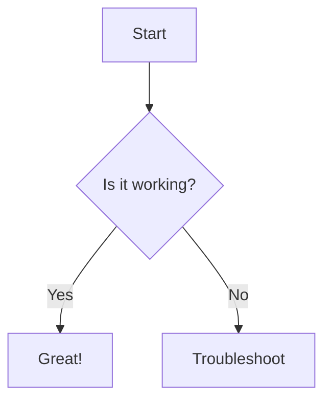
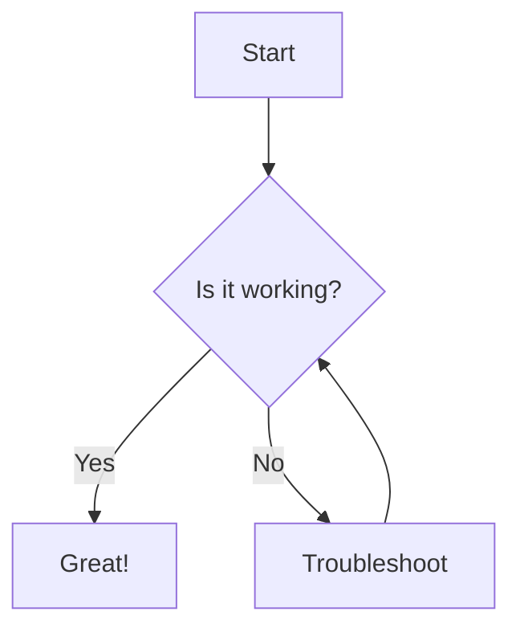
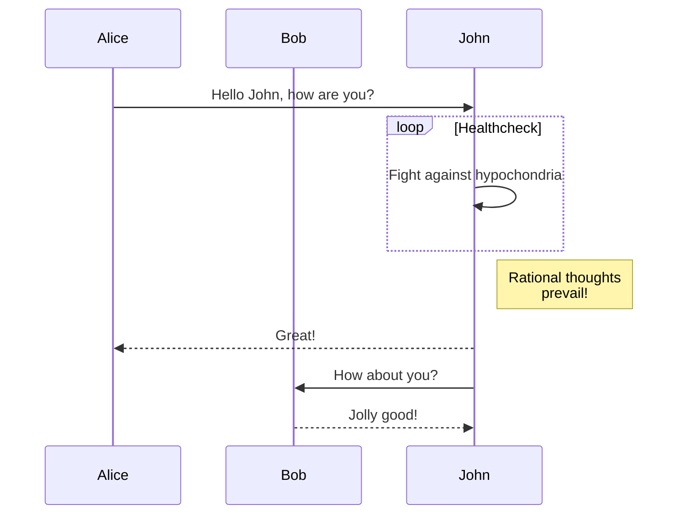
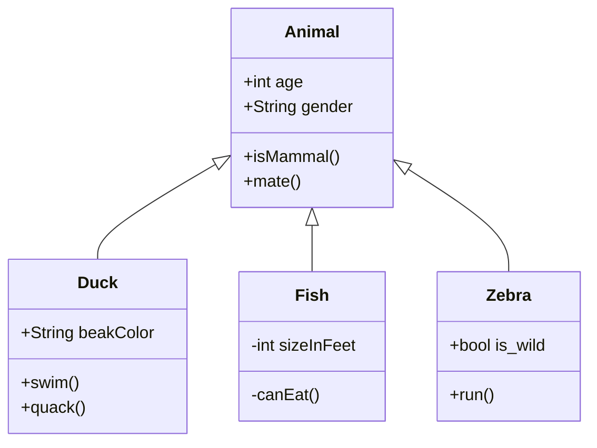
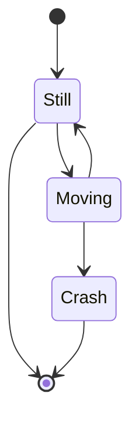
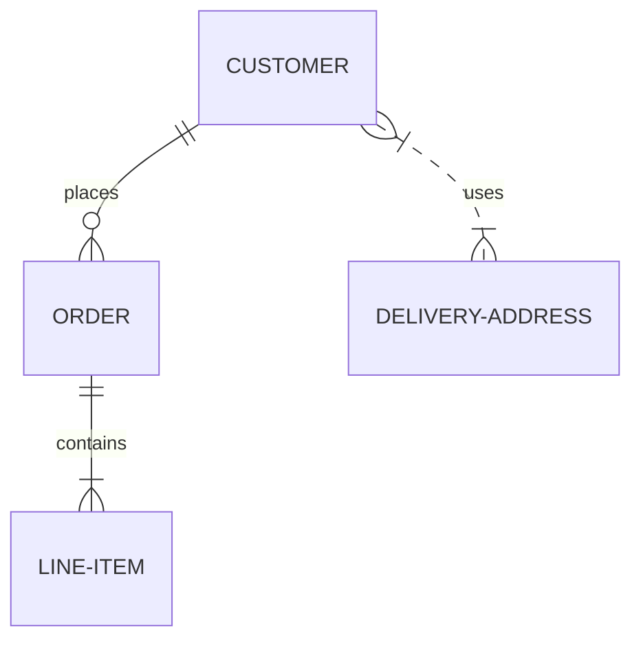
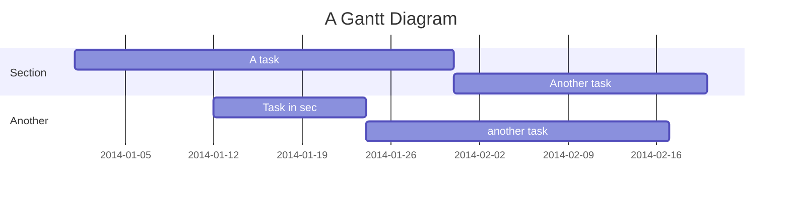
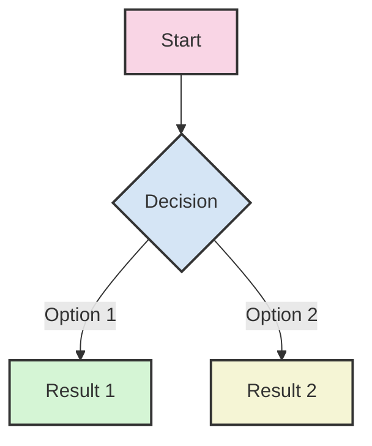

# Mermaid Diagrams

`opendocs` supports Mermaid diagrams, allowing you to create various types of diagrams directly in your MDX files.

## Basic Syntax

To create a Mermaid diagram, use the capitalized `Mermaid` component:

```mdx
<Mermaid>
graph TD
    A[Start] --> B{Is it working?}
    B -->|Yes| C[Great!]
    B -->|No| D[Troubleshoot]
</Mermaid>
```

You can also use code blocks with the mermaid language:

````mdx

````

## Diagram Types

### Flowchart

<Mermaid>
graph TD
    A[Start] --> B{Is it working?}
    B -->|Yes| C[Great!]
    B -->|No| D[Troubleshoot]
    D --> B
</Mermaid>

**Code:**

```mdx

```

### Sequence Diagram



**Code:**

```mdx

```

### Class Diagram



**Code:**

```mdx

```

### State Diagram



**Code:**

```mdx

```

### Entity Relationship Diagram



**Code:**

```mdx

```

### Gantt Chart



**Code:**

```mdx

```

## Customizing Diagrams

You can customize the appearance of your diagrams using Mermaid's styling options:



**Code:**

```mdx

```

For more information on Mermaid syntax and options, visit the [Mermaid documentation](https://mermaid-js.github.io/mermaid/#/).
