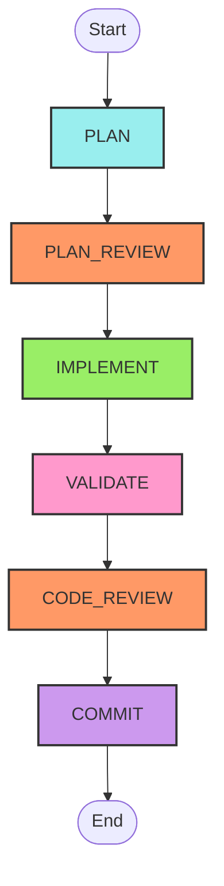
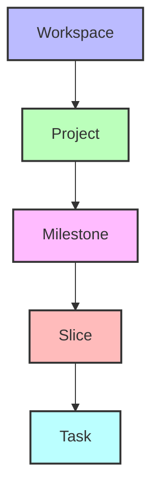
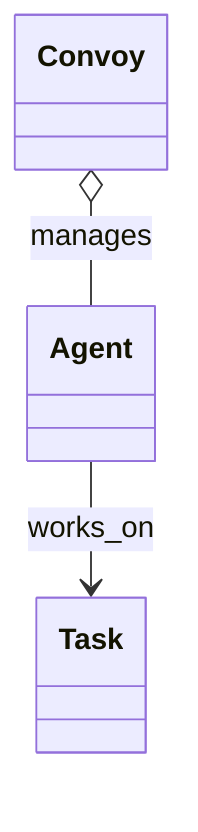

# Mermaid Fixing Demo

This page demonstrates the fixed Mermaid diagrams integration.

## Convoy Workflow Diagram

```mermaid
flowchart TD
    Start([Start]) --> Plan[PLAN]
    Plan --> PlanReview[PLAN_REVIEW]
    PlanReview --> Implement[IMPLEMENT]
    Implement --> Validate[VALIDATE]
    Validate --> CodeReview[CODE_REVIEW]
    CodeReview --> Commit[COMMIT]
    Commit --> End([End])

    style Plan fill:#9ee, stroke:#333, stroke-width:2px
    style PlanReview fill:#f96, stroke:#333, stroke-width:2px
    style Implement fill:#9e6, stroke:#333, stroke-width:2px
    style Validate fill:#f9c, stroke:#333, stroke-width:2px
    style CodeReview fill:#f96, stroke:#333, stroke-width:2px
    style Commit fill:#c9e, stroke:#333, stroke-width:2px
```

## Hierarchical Structure Diagram

```mermaid
flowchart TD
    Workspace[Workspace] --> Project[Project]
    Project --> Milestone[Milestone]
    Milestone --> Slice[Slice]
    Slice --> Task[Task]

    style Workspace fill:#bbf, stroke:#333, stroke-width:2px
    style Project fill:#bfb, stroke:#333, stroke-width:2px
    style Milestone fill:#fbf, stroke:#333, stroke-width:2px
    style Slice fill:#fbb, stroke:#333, stroke-width:2px
    style Task fill:#bff, stroke:#333, stroke-width:2px
```

## Class Diagram

```mermaid
classDiagram
    class Convoy
    class Agent
    class Task

    Convoy o-- Agent: manages
    Agent --> Task: works_on
```
