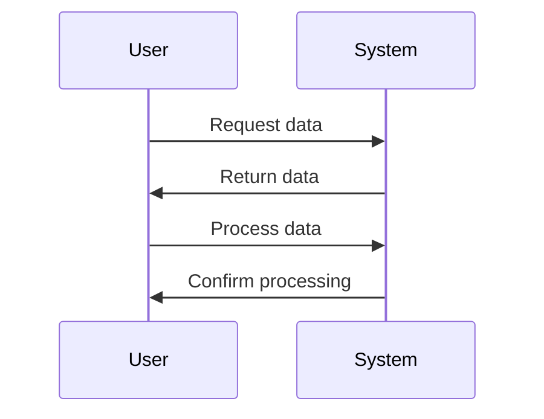
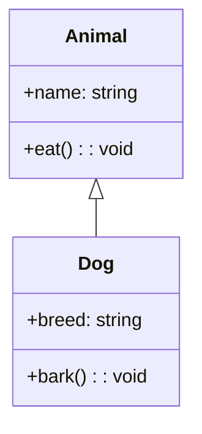

# Mermaid Diagram Test (Fixed)

This page tests both the capitalized and non-capitalized versions of the Mermaid component.

## Using Capitalized Component

<Mermaid>
graph TD
    A[Start] --> B{Is it working?}
    B -->|Yes| C[Great!]
    B -->|No| D[Troubleshoot]
    D --> B
</Mermaid>

## Using Non-Capitalized Component

## Using Mermaid Code Block

