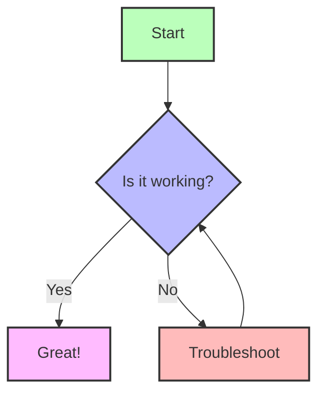
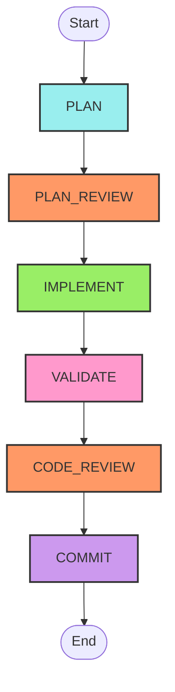

# Simple Mermaid Test

This page demonstrates the simplest approach to Mermaid diagrams in MDX.

## Basic Diagram



## Workflow Diagram



## Simple Class Diagram

```mermaid
classDiagram
    class Convoy
    class Agent
    class Task

    Convoy o-- Agent: manages
    Agent --> Task: works_on
