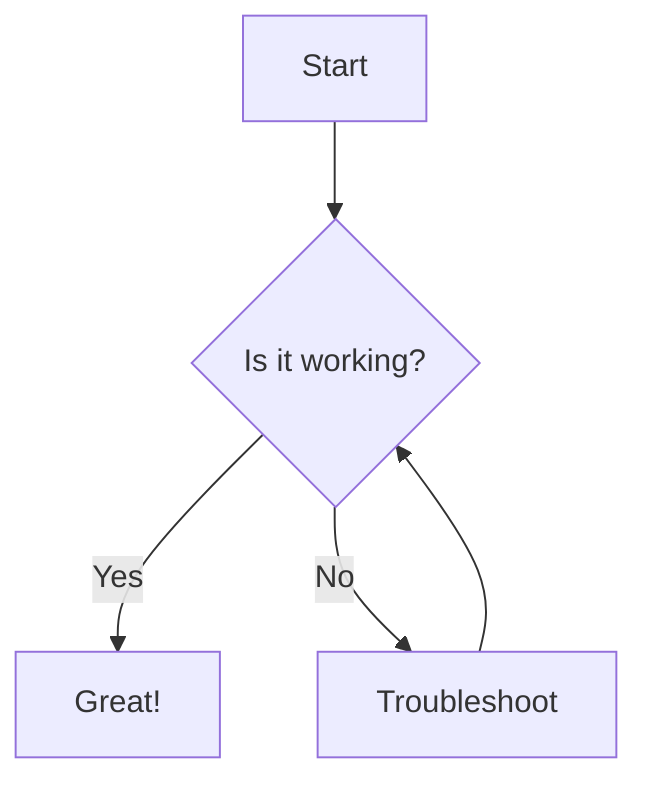
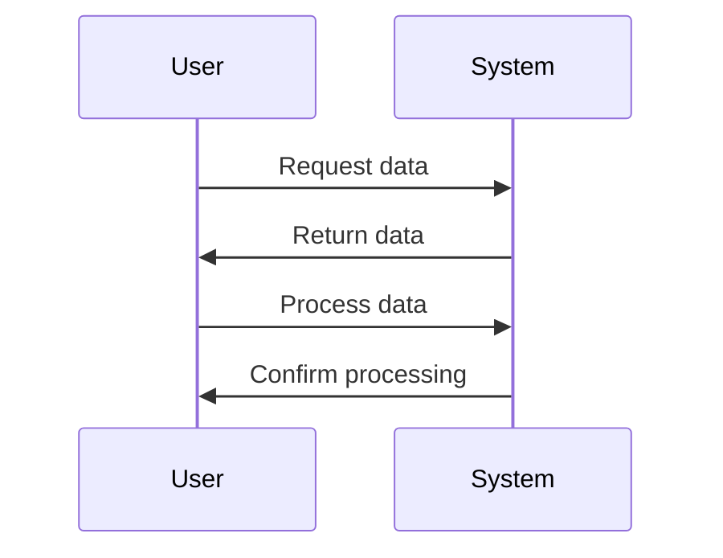

# Mermaid Diagram Test (Component)

This page tests Mermaid diagrams using both the standard mermaid block and a standard code block.

## Using Standard Mermaid Component



## Using Code Block with Mermaid Language



## Using Explicit Code Block Syntax

In Markdown, we can also try the explicit code block syntax:

```
graph LR
    A[Square Rect] -- Link text --> B((Circle))
    A --> C(Round Rect)
    B --> D{Rhombus}
    C --> D
