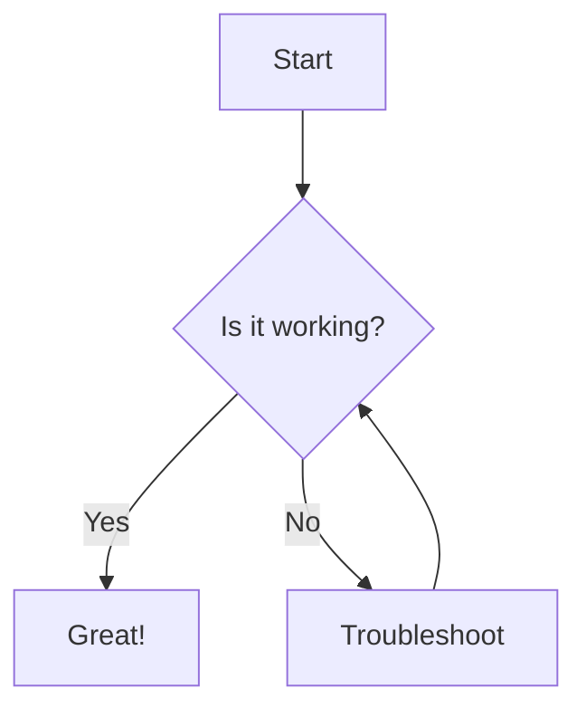
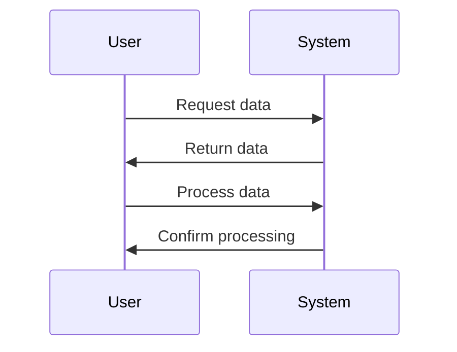
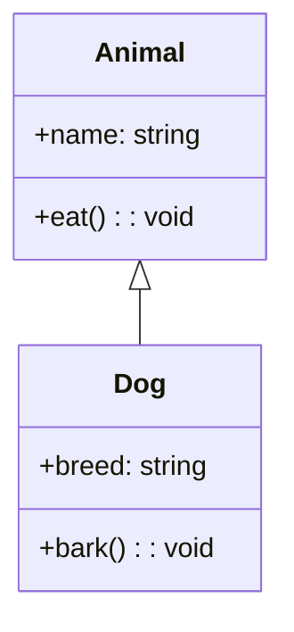

# Mermaid Diagram Test (Fixed)

This is a test page to verify that Mermaid diagrams work in our documentation.

## Basic Flowchart

```mermaid
graph TD
    A[Start] --> B{Is it working?}
    B -->|Yes| C[Great!]
    B -->|No| D[Troubleshoot]
    D --> B
```

## Sequence Diagram

```mermaid
sequenceDiagram
    participant User
    participant System
    User->>System: Request data
    System->>User: Return data
    User->>System: Process data
    System->>User: Confirm processing
```

## Class Diagram

```mermaid
classDiagram
    class Animal{
        +name: string
        +eat(): void
    }
    class Dog{
        +breed: string
        +bark(): void
    }
    Animal <|-- Dog
```
