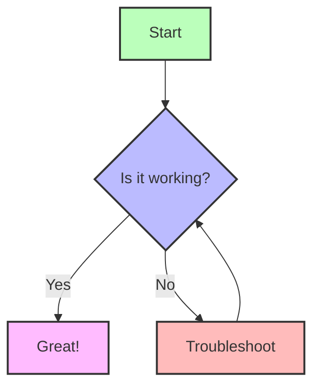
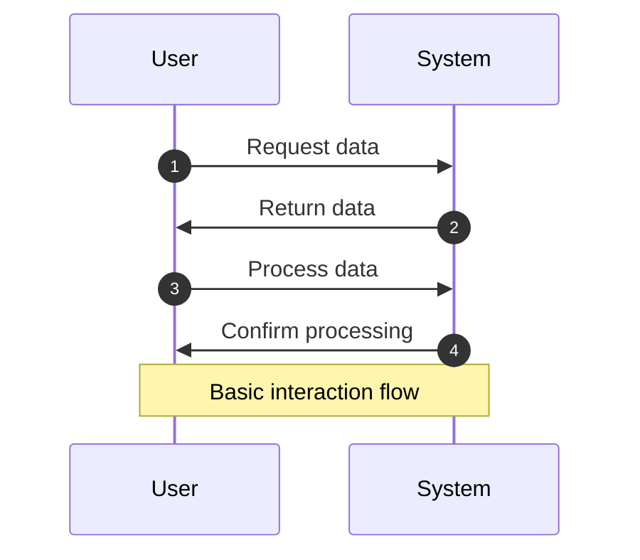
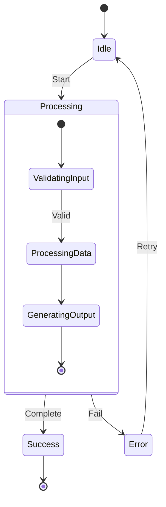
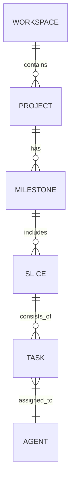

# Mermaid Diagram Test (Updated)

This is an updated test page for Mermaid diagrams using code blocks.

## Basic Flowchart Example



## Sequence Diagram Example



## State Diagram Example



## Entity Relationship Diagram



## Class Diagram Example

```mermaid
classDiagram
    class Convoy {
        +name: string
        +version: number
        +init(): void
        +run(): void
    }

    class Agent {
        +id: string
        +skills: string[]
        +completeTask(task: Task): void
    }

    class Task {
        +id: string
        +status: TaskStatus
        +start(): void
        +complete(): void
    }

    Convoy o-- Agent: manages
    Agent --> Task: works_on
