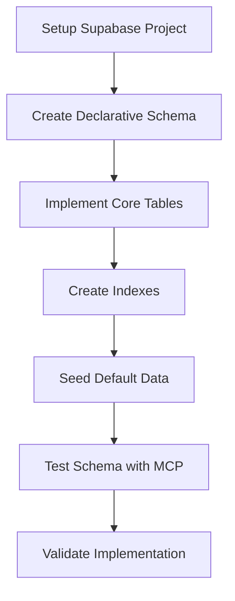

# Supabase Integration Implementation Plan

## Overview

This document outlines the detailed implementation plan for setting up the Convoy database in Supabase using the declarative schema approach. The plan follows a step-by-step process to create the entire knowledge graph structure, optimized for AI context retrieval.

## Implementation Approach

We'll use Supabase's declarative schema approach to define and version-control our database schema. This approach allows us to:

1. Define the entire database schema in SQL files
2. Apply migrations incrementally 
3. Track changes through version control
4. Roll back changes if needed
5. Maintain consistency across environments

## Implementation Steps

### 1. Setup Supabase Project

**Activities:**
- Create a new Supabase project (or use existing)
- Configure project settings
- Set up authentication methods
- Create database access credentials
- Configure MCP connection

**Tools/Resources:**
- Supabase dashboard
- Supabase CLI
- Supabase MCP

**Completion Criteria:**
- Supabase project is created and accessible
- Database connection is established
- MCP connection is configured

### 2. Create Declarative Schema Structure

**Activities:**
- Create a migrations directory for SQL files
- Define schema versioning approach
- Set up extension requirements (uuid-ossp)
- Plan table creation order (respecting dependencies)
- Create initial migration file

**Tools/Resources:**
- Code editor
- Git for version control
- Supabase CLI for local development

**Completion Criteria:**
- Migration structure is established
- Initial migration file is created
- Version control is configured

### 3. Implement Core Database Tables

**Activities:**
- Create the following tables with proper relationships:
  - workspaces
  - projects
  - milestones
  - tasks
  - activity_feed
  - task_dependencies
  - workflows
  - patterns
  - best_practices
- Define appropriate data types and constraints
- Establish foreign key relationships
- Add default values where appropriate

**Tools/Resources:**
- SQL editor
- Supabase dashboard for testing
- Knowledge base schema documentation

**Completion Criteria:**
- All tables are created with proper structure
- Relationships are correctly defined
- Constraints are properly implemented

### 4. Create Indexes for Performance

**Activities:**
- Identify common query patterns
- Create indexes for foreign key columns
- Add indexes for frequently searched fields
- Optimize for context retrieval queries

**Tools/Resources:**
- SQL optimization tools
- PostgreSQL documentation
- Database performance testing

**Completion Criteria:**
- All necessary indexes are created
- Query performance is optimized
- Indexes follow PostgreSQL best practices

### 5. Seed Default Data

**Activities:**
- Create standard workflow definition
- Seed basic workspace data
- Add example patterns and best practices
- Generate test data for validation

**Tools/Resources:**
- SQL INSERT statements
- Workflow definition from documentation
- Test data generation scripts

**Completion Criteria:**
- Standard workflow is seeded
- Basic reference data is available
- Test data is loaded for validation

### 6. Test Schema with Supabase MCP

**Activities:**
- Connect to database via Supabase MCP
- Create test queries for context retrieval
- Validate relationship traversal
- Test CRUD operations on all tables

**Tools/Resources:**
- Supabase MCP
- Test scripts
- Query validation tools

**Completion Criteria:**
- MCP connection is successful
- Context retrieval queries work correctly
- All CRUD operations function as expected

### 7. Document Implementation

**Activities:**
- Document schema structure
- Create query examples for common operations
- Document context retrieval process
- Add implementation notes and considerations

**Tools/Resources:**
- Markdown documentation
- Code examples
- Database diagrams

**Completion Criteria:**
- Documentation is complete and accurate
- Query examples are provided
- Implementation notes are comprehensive

## Task Breakdown

| Task ID | Description | Status | Dependencies |
|---------|-------------|--------|--------------|
| TASK-001 | Supabase Project Setup | to-do | None |
| TASK-002 | Declarative Schema Creation | backlog | TASK-001 |
| TASK-003 | Core Table Implementation | backlog | TASK-002 |
| TASK-004 | Index Creation | backlog | TASK-003 |
| TASK-005 | Data Seeding | backlog | TASK-004 |
| TASK-006 | MCP Integration Testing | backlog | TASK-005 |
| TASK-007 | Documentation | backlog | TASK-006 |

## Risk Mitigation

| Risk | Mitigation Strategy |
|------|---------------------|
| Complex schema implementation errors | Incremental implementation with testing after each table |
| Performance issues with deep relationships | Careful index design and query optimization |
| JSON structure complexities | Use PostgreSQL JSONB type with proper validation |
| Data integrity concerns | Implement proper constraints and validations |
| Migration challenges | Use declarative approach for incremental changes |

## Timeline and Milestones

| Milestone | Date | Deliverables |
|-----------|------|--------------|
| Setup Complete | 04/14/2025 | Supabase project, migration structure |
| Schema Implementation | 04/15/2025 | All tables, relationships, indexes |
| Seed Data | 04/15/2025 | Standard workflow, test data |
| Testing and Validation | 04/16/2025 | Query tests, performance validation |
| Documentation | 04/16/2025 | Schema docs, query examples |

This implementation plan provides a structured approach to creating the Convoy database in Supabase, ensuring that all components of the knowledge graph are properly implemented and optimized for AI context retrieval.
