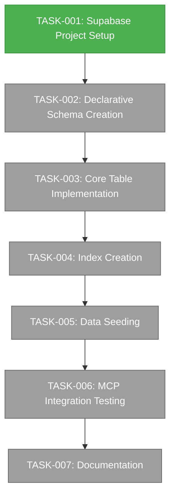

# Supabase Integration Tasks

This directory contains tasks for the Supabase Integration project. Each task represents a specific unit of work that contributes to the overall project implementation.

## Task List

| ID | Name | Status | Description |
|----|------|--------|-------------|
| TASK-001 | [Supabase Project Setup](./TASK-001-supabase-project-setup.md) | to-do | Setting up the Supabase project for Convoy database implementation |
| TASK-002 | [Declarative Schema Creation](./TASK-002-declarative-schema-creation.md) | backlog | Creating the declarative schema structure for the Convoy database |
| TASK-003 | [Core Table Implementation](./TASK-003-core-table-implementation.md) | backlog | Implementing the core database tables for the Convoy knowledge graph |
| TASK-004 | [Index Creation](./TASK-004-index-creation.md) | backlog | Creating indexes for performance optimization in the Convoy database |
| TASK-005 | [Data Seeding](./TASK-005-data-seeding.md) | backlog | Seeding initial data into the Convoy database |
| TASK-006 | [MCP Integration Testing](./TASK-006-mcp-integration-testing.md) | backlog | Testing the Supabase MCP integration for Convoy context retrieval |
| TASK-007 | [Documentation](./TASK-007-documentation.md) | backlog | Creating comprehensive documentation for the Convoy database implementation |

## Task Dependencies



## Task Workflow

All tasks follow the standard Convoy development workflow:

```
PLAN → PLAN_REVIEW → IMPLEMENT → VALIDATE → CODE_REVIEW → COMMIT
```

Each task includes:
- Detailed description of the work to be done
- Implementation details and approach
- Sub-tasks that break down the work
- Dependencies on other tasks
- Completion criteria

## Task Status Guidelines

Tasks follow these status designations:

| Status | Description | AI Processing |
|--------|-------------|---------------|
| backlog | Tasks that are planned but not ready yet | Not eligible |
| to-do | Tasks that are ready to be worked on | Eligible (if project active) |
| in-progress | Tasks currently being worked on | Not eligible |
| completed | Tasks that have been completed | Not eligible |

AI agents will only work on tasks marked as "to-do" in active projects.

## Task Naming Convention

Tasks follow an ID-based naming convention:

```
TASK-{id}-{descriptive-name}.md
```

For example:
- `TASK-001-supabase-project-setup.md`
- `TASK-002-declarative-schema-creation.md`
- `TASK-003-core-table-implementation.md`
