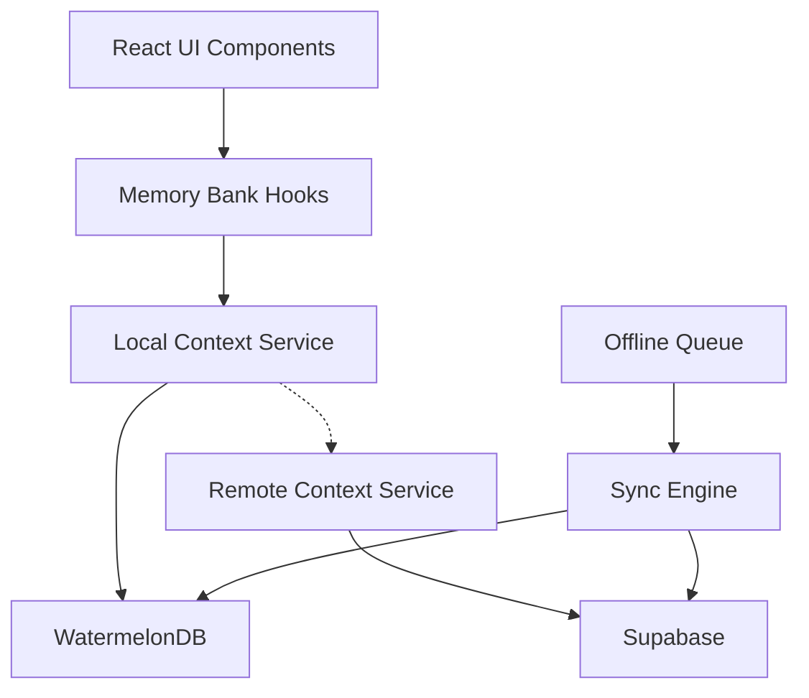

# Offline-First Architecture: Technical Overview

This document provides a technical overview of the offline-first architecture for Convoy, detailing how WatermelonDB is integrated with Supabase to create a robust local-first data access pattern with synchronization capabilities.

## Architecture Overview

The offline-first architecture consists of the following key components:



### Key Components

1. **WatermelonDB**: Local database that stores a subset of the Supabase data for offline access
2. **Sync Engine**: Manages bidirectional synchronization between WatermelonDB and Supabase
3. **Local Context Service**: Provides context retrieval from the local database with fallback to remote
4. **Offline Queue**: Manages operations performed while offline for later synchronization
5. **Memory Bank Hooks**: React hooks for accessing the local-first context

## WatermelonDB Integration

### Database Models

WatermelonDB models will mirror our Supabase schema for key entities:

```typescript
// Example model definition for Task
class Task extends Model {
  static table = 'tasks'
  static associations = {
    milestones: { type: 'belongs_to', key: 'milestone_id' },
    parent_tasks: { type: 'belongs_to', key: 'parent_task_id' },
    subtasks: { type: 'has_many', foreignKey: 'parent_task_id' },
    activities: { type: 'has_many', foreignKey: 'task_id' }
  }

  @field('title') title
  @field('description') description
  @field('current_stage') currentStage
  @field('status') status
  @field('created_at') createdAt
  @field('updated_at') updatedAt
  @field('completion_date') completionDate
  @relation('milestones', 'milestone_id') milestone
  @relation('tasks', 'parent_task_id') parentTask
  @children('tasks') subtasks
  @children('activity_feed') activities
}
```

All core entities will have corresponding model definitions with appropriate relationships.

### Sync Strategy

The sync strategy varies by entity type:

1. **Reference Data**: Workflows, patterns, and best practices
   - Full sync with periodic refresh
   - Local-only updates not allowed

2. **Structural Data**: Workspaces, projects, milestones
   - Incremental sync based on timestamps
   - Conflict resolution prioritizes remote changes

3. **Task Data**: Tasks, activities, dependencies
   - Bi-directional sync with conflict resolution
   - Field-level merging for concurrent changes

4. **Offline-Created Data**: New tasks, activities
   - Queued for sync when online
   - Temporary IDs replaced with permanent IDs on sync

### Sync Process

The sync process follows this general pattern:

1. **Pull Phase**:
   - Fetch changes since last sync using timestamps
   - Apply changes to local database
   - Handle conflicts according to entity-specific strategies

2. **Push Phase**:
   - Collect local changes since last sync
   - Send changes to Supabase
   - Process server responses and handle conflicts
   - Update local records with server changes

3. **Cleanup Phase**:
   - Update sync metadata
   - Clean up temporary data
   - Update sync statistics

## Local Context Service

The Local Context Service adapts our existing Context Service to use WatermelonDB as its primary data source:

```typescript
// Example method to retrieve task context locally
export async function getTaskContextLocal(taskId: string): Promise<TaskContext | null> {
  try {
    // Get the task with relationships from WatermelonDB
    const task = await database.get('tasks').find(taskId).then(task => 
      task.observe().pipe(
        switchMap(task => 
          combineLatest([
            task.milestone.observe(),
            task.milestone.project.observe(),
            task.milestone.project.workspace.observe(),
            task.parent_task ? task.parent_task.observe() : of(null),
            task.subtasks.observeWithColumns(['id', 'title']),
            task.activities.observeWithColumns(['id', 'created_at', 'activity_type'])
              .pipe(take(20), toArray()),
            // Additional relationship queries
          ])
        )
      ).pipe(take(1)).toPromise()
    );

    // If local data is incomplete, fall back to remote
    if (!task || !task.milestone) {
      return getTaskContextRemote(taskId);
    }

    // Assemble and return the complete context
    return {
      task,
      milestone: task.milestone,
      project: task.milestone.project,
      workspace: task.milestone.project.workspace,
      parent_task: task.parent_task,
      subtasks: task.subtasks,
      // Additional context assembly
    };
  } catch (error) {
    console.error('Error retrieving local task context:', error);
    
    // Fall back to remote context retrieval
    return getTaskContextRemote(taskId);
  }
}
```

## Offline Operations

Offline operations are handled through a queue system:

1. **Operation Recording**:
   - Each create/update/delete operation is recorded in the queue
   - Operations include entity type, operation type, entity ID, and changes
   - Dependencies between operations are tracked

2. **Queue Processing**:
   - When connectivity is restored, queue is processed in dependency order
   - Operations are applied to Supabase
   - Results are applied back to local database
   - Conflicts are resolved according to strategy

3. **Failure Handling**:
   - Failed operations are retried with exponential backoff
   - Critical failures are surfaced to the user
   - Partial sync is supported to recover from failures

## Conflict Resolution

Conflict resolution follows these principles:

1. **Last-Write-Wins**: For most simple conflicts
2. **Field-Level Merging**: For complex objects with independent field changes
3. **Structural Prioritization**: Remote changes win for structural entities
4. **User Resolution**: For critical conflicts that cannot be automatically resolved

## React Hooks Integration

The Memory Bank hooks are adapted to use the local context:

```typescript
export function useMemoryBank(taskId?: string) {
  const [context, setContext] = useState<TaskContext | null>(null);
  const [isLoading, setIsLoading] = useState<boolean>(false);
  const [error, setError] = useState<Error | null>(null);
  const [syncStatus, setSyncStatus] = useState<SyncStatus>('synced');

  // Use the local context service with sync awareness
  const fetchContext = useCallback(async (id: string) => {
    setIsLoading(true);
    setError(null);
    
    try {
      // Get context from local database
      const taskContext = await getTaskContextLocal(id);
      setContext(taskContext);
      
      // Check sync status
      const isSynced = await checkSyncStatus(id);
      setSyncStatus(isSynced ? 'synced' : 'pending');
    } catch (err) {
      setError(err instanceof Error ? err : new Error('Failed to load context'));
      setContext(null);
    } finally {
      setIsLoading(false);
    }
  }, []);

  // Additional hook implementation
  // ...

  return {
    context,
    isLoading,
    error,
    refreshContext,
    syncStatus,
    syncNow    // Function to trigger immediate sync
  };
}
```

## Performance Optimizations

The implementation includes several performance optimizations:

1. **Selective Sync**: Only sync data relevant to current workspace
2. **Lazy Loading**: Load related data on demand
3. **Batch Processing**: Process sync in batches to optimize performance
4. **Index Optimization**: Create optimized indexes for common queries
5. **Change Tracking**: Only sync changed records
6. **Compression**: Compress data for sync operations

## Implementation Phases

The implementation follows these phases:

1. **Foundation**: WatermelonDB setup and basic models
2. **Core Sync**: Basic bidirectional synchronization
3. **Local Context**: Local-first context retrieval with fallback
4. **Advanced Features**: Conflict resolution, offline queue, multi-device support
5. **Optimization**: Performance tuning and bandwidth optimization

## Technical Challenges

Several technical challenges must be addressed:

1. **Schema Consistency**: Ensuring WatermelonDB and Supabase schemas remain compatible
2. **Conflict Detection**: Detecting and resolving conflicts efficiently
3. **Sync Efficiency**: Minimizing data transfer for synchronization
4. **Offline UX**: Creating a seamless user experience regardless of connectivity
5. **Multi-Device Consistency**: Ensuring consistent state across multiple devices

## Testing Approach

The testing approach includes:

1. **Unit Tests**: For individual components
2. **Integration Tests**: For sync process and conflict resolution
3. **Scenario Tests**: For different connectivity patterns
4. **Performance Tests**: For sync efficiency and local query performance
5. **Stress Tests**: For large datasets and extended offline periods

## Conclusion

The offline-first architecture dramatically improves the user experience by providing immediate access to data regardless of connectivity. By combining WatermelonDB for local storage with Supabase for remote data, we create a resilient system that works seamlessly in varied network conditions while maintaining data integrity and consistency.
