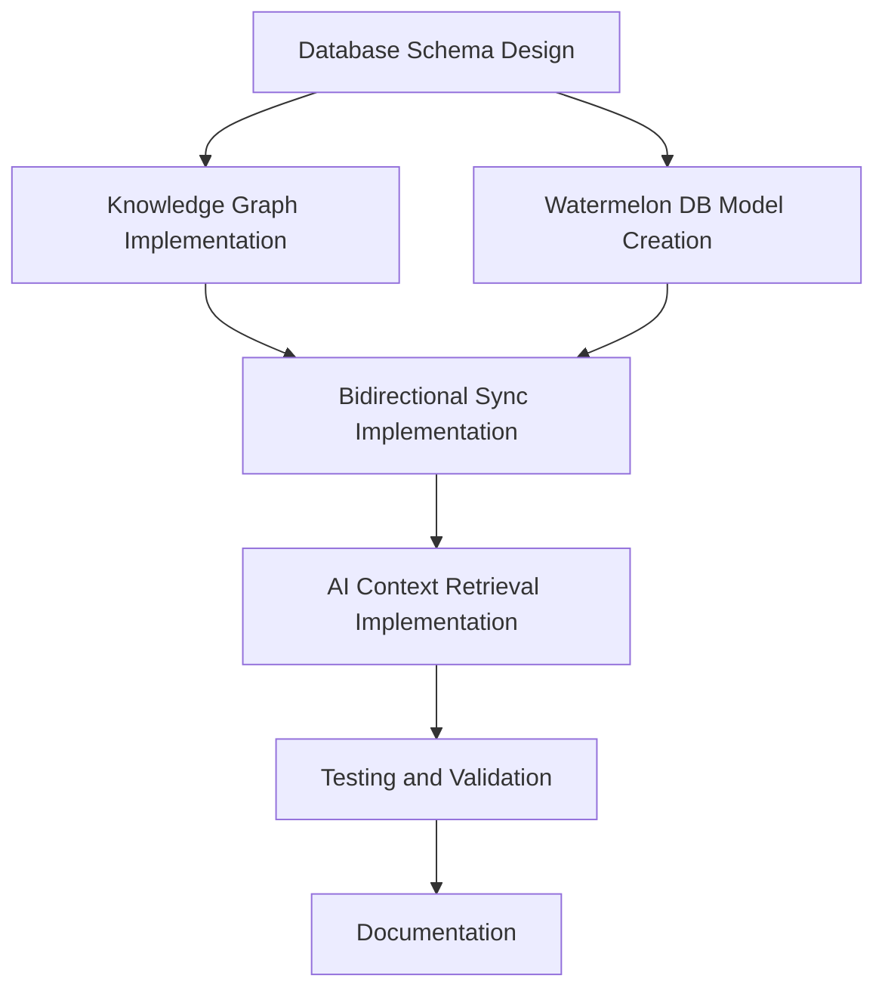

# Data Architecture Implementation Tasks

This directory contains tasks for implementing the data architecture for workspaces, projects, workstreams, and tasks in the Convoy system. The tasks are organized according to the implementation phases outlined in the project plan.

## Task Listing

| ID | Name | Status | Description |
|----|------|--------|-------------|
| TASK-001 | Database Schema Design | backlog | Design and implement the database schema for all entities |
| TASK-002 | Knowledge Graph Implementation | backlog | Implement the relationship graph structure |
| TASK-003 | Watermelon DB Model Creation | backlog | Create models for local storage |
| TASK-004 | Bidirectional Sync Implementation | backlog | Implement sync between local and remote storage |
| TASK-005 | AI Context Retrieval Implementation | backlog | Create context providers for AI |
| TASK-006 | Testing and Validation | backlog | Comprehensive testing of all components |
| TASK-007 | Documentation | backlog | Document the architecture and APIs |

## Dependencies

The tasks have the following dependencies:

## Task Status Guidelines

Tasks in this project follow these status designations:

| Status | Description | AI Processing |
|--------|-------------|---------------|
| backlog | Tasks that are planned but not ready yet | Not eligible |
| to-do | Tasks that are ready to be worked on | Eligible |
| in-progress | Tasks currently being worked on | Not eligible |
| completed | Tasks that have been completed | Not eligible |

AI agents will only work on tasks explicitly marked as "to-do" in this project.

## Task Assignment

Task assignment is determined by the task's owner field. Tasks without an assigned owner are available for any team member to work on.

## Task Updates

When updating a task's status or progress, ensure that:

1. The task status is accurately reflected in the task document
2. The task document is updated with the latest progress information
3. Any dependencies are appropriately managed
4. The project overview is updated if task status changes affect project timeline
