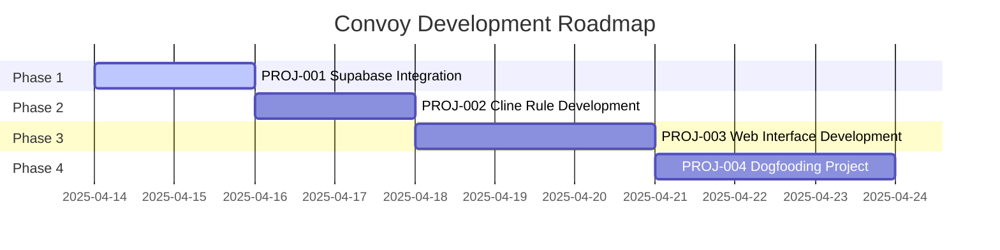

# Convoy Development Projects

This directory contains documentation for all projects within the Convoy Development initiative. Each project has its own directory containing project details, implementation plans, and tasks.

## Project Structure

Each project directory follows this standardized structure:

```
PROJ-{id}-{name}/
├── overview.md            # Project overview, goals, constraints
├── plan.md                # Implementation plan
└── tasks/                 # Individual task documents
    ├── README.md          # Overview of all tasks in this project
    └── TASK-{id}-{name}.md # Individual task documents
```

## Project Naming Convention

Projects follow an ID-based naming convention:

```
PROJ-{id}-{name}/
```

For example:
- `PROJ-001-supabase-integration/`
- `PROJ-002-cline-rule-development/`
- `PROJ-003-web-interface-development/`

## Current Projects

### Active Projects

| ID | Name | Status | Description |
|----|------|--------|-------------|
| PROJ-001 | [Supabase Integration](./PROJ-001-supabase-integration/) | Active | Setting up Supabase infrastructure for knowledge graph |

### Planned Projects

| ID | Name | Status | Description |
|----|------|--------|-------------|
| PROJ-002 | Cline Rule Development | Planned | Creating the Cline rule file for AI guidance |
| PROJ-003 | Web Interface Development | Planned | Developing the web interface for task management |
| PROJ-004 | Dogfooding Project | Planned | Using the system to build itself and evaluate effectiveness |

## Roadmap Timeline

This initiative implements the roadmap phases with the following projects:



## Project Guidelines

When creating or updating project documentation:

1. Use the standard ID-based naming convention
2. Include complete metadata in all documentation files
3. Break down work into manageable tasks with clear descriptions
4. Follow the six-stage workflow for all tasks
5. Maintain relationships between related tasks
6. Explicitly mark task status as appropriate

Each project should have a clear objective, well-defined scope, and measurable success criteria. The documentation structure ensures that all aspects of the project are properly documented and accessible.

## Task Status Guidelines

Tasks in all projects follow these status designations:

| Status | Description | AI Processing |
|--------|-------------|---------------|
| backlog | Tasks that are planned but not ready yet | Not eligible |
| to-do | Tasks that are ready to be worked on | Eligible (if project active) |
| in-progress | Tasks currently being worked on | Not eligible |
| completed | Tasks that have been completed | Not eligible |

AI agents will only work on tasks marked as "to-do" in active projects.
